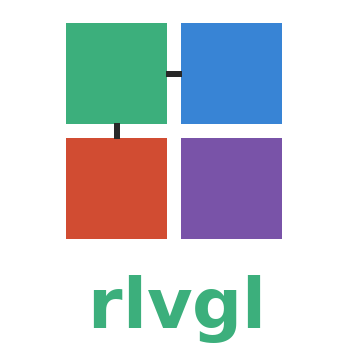
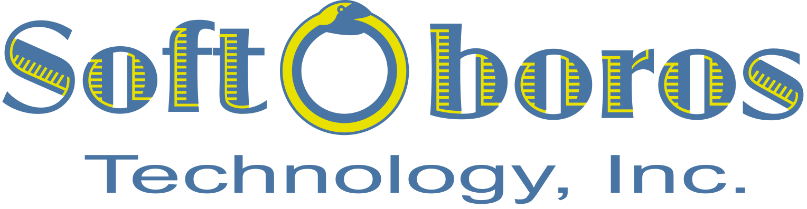

<!--
README.md - Top-level overview and navigation for rlvgl.
-->
<p align="center">
  
</p>

<span style="font-size:26px"><b>rlvgl</b></span> is a modular, idiomatic Rust reimplementation of LVGL (Light and Versatile Graphics Library).

rlvgl preserves the widget-based UI paradigm of LVGL while eliminating unsafe C-style memory management and global state. This library is structured to support no_std environments, embedded targets (e.g., STM32H7), and simulator backends for rapid prototyping.

The C version of LVGL is included as a git submodule for reference and test vector extraction, but not linked or compiled into this library.

## Goals
Package: `rlvgl`
- Preserve LVGL architecture and layout system
- Replace C memory handling with idiomatic Rust ownership
- Support embedded display flush/input via embedded-hal
- Enable widget hierarchy, styles, and events using Rust traits
- Use existing Rust crates where possible (e.g., embedded-graphics, heapless, tinybmp)

## Features
- no_std + allocator support with simulator-friendly std features
- Modular workspace crates for core widgets, platform backends, UI helpers, API bindings, and i18n
- `rlvgl-creator` support for asset preparation, vendor database browsing, and STM32 BSP generation from CubeMX `.ioc` files
- Application Schema (`rlvgl-app/v0`) — declarative `app.yaml` manifest plus `rlvgl-creator app from-yaml` orchestrator emit a buildable Cargo crate from one source of truth (BSP, assets, state machine, i18n, theme, layouts, per-prong main glue). See [`docs/app-schema/`](docs/app-schema/).
- Vendor chip database crates and generated STM BSP crates for board-aware tooling
- Flagship STM32H747I-DISCO demo covering DSI display, touch, SDRAM, SD/MMC, audio, and DMA2D-assisted rendering
- Motion, compositor, dirty-region, and accelerated blitting primitives for richer embedded UIs
- Pluggable display and input backends for both embedded targets and host simulation
- Optional Lottie support for dynamic playback and offline asset conversion workflows

## Project Structure
- [core](./core/README.md) – Widget base trait, layout, event dispatch
- [widgets](./widgets/README.md) – Rust-native reimplementations of LVGL widgets
- [platform](./platform/README.md) – Display/input traits and HAL adapters
- [ui](./ui/README.md) – Higher-level UI components
- [examples/apps/demo](./examples/apps/demo/README.md) – Packaged demo application crate
- [api](./api/src/lib.rs) – Shared ABI types for bindings and coprocessor integrations
- [i18n](./i18n/README.md) – Compile-time translations with runtime-selectable locale blobs
- [chipdb](./chipdb/README.md) – Vendor chip databases used by creator and BSP generation
- [chips/stm/bsps](./chips/stm/bsps/README.md) – Generated STM32 BSP modules
- [rlvgl-creator](./src/bin/creator/README.md) – Asset and BSP workflows for command-line and UI tooling
- [examples](./examples/README.md) – Sample applications and board demos
- [docs](./docs/README.md) – Project documentation and task lists
- [docs/disco-tutorial](./docs/disco-tutorial/README.md) – Progressive, chapter-by-chapter guide to building the STM32H747I-DISCO demo from scratch
- [docs/disco-platform-guide](./docs/disco-platform-guide/README.md) – Volume II: bare-metal STM32H747I-DISCO platform bring-up, SVD/PAC limits, AXI holdoff, and the star crawl in full detail
- [docs/disco-test-and-debug](./docs/disco-test-and-debug/README.md) – Volume III: how to test and debug across the host simulator, UEFI/QEMU, and hardware, including playit automation and VS Code + probe-rs + GDB
- [docs/disco-freertos-guide](./docs/disco-freertos-guide/README.md) – Volume IV: FreeRTOS preemptive tasks, interrupt-driven I2C4 touch, single-buffer rendering, joystick navigation
- [docs/disco-zephyr-guide](./docs/disco-zephyr-guide/README.md) – Volume V: Zephyr C+Rust hybrid, video mode vs adapted command mode, DMA2D pipeline, CSleep/LPENR fix
- [lvgl](./lvgl/README.md) – C submodule (reference only)

## Building Binary Targets

The workspace currently ships six user-facing binaries. Their package names,
required targets, and applicable feature flags differ enough that it is best to
treat them individually instead of relying on `cargo build --workspace`. Every
binary has a top-level `make` target — run `make help` to see them all, or
`make build-all-bins` to build every binary in one command.

### Host tools and simulators

| Binary | Package | Make target | Cargo command |
| --- | --- | --- | --- |
| `rlvgl-creator` | `rlvgl` | `make build-creator` | `cargo build -p rlvgl --bin rlvgl-creator --features creator` |
| `rlvgl-sim` | `rlvgl-example-sim` | `make build-sim` | `cargo build -p rlvgl-example-sim --bin rlvgl-sim --features png,jpeg,gif,qrcode,fontdue` |
| `rlvgl-disco-sim` | `rlvgl-example-disco-sim` | `make build-disco-sim` | `cargo build -p rlvgl-example-disco-sim --bin rlvgl-disco-sim` |
| `rlvgl-uefi-disco` | `rlvgl-example-uefi-disco` | `make build-uefi-disco` | `cargo build --manifest-path examples/uefi-disco/Cargo.toml --target aarch64-unknown-uefi --bin rlvgl-uefi-disco` |

Notes: `rlvgl-creator` is gated behind the `creator` feature; add `creator_ui`
for the desktop UI. `rlvgl-sim` accepts `--no-default-features` for a lean
build. `rlvgl-uefi-disco` is intentionally excluded from the workspace.

### STM32H747I-DISCO firmware

The firmware package is `rlvgl-example-disco` and it produces two binaries from
the same crate:

| Binary | Required target | Required feature | Make target | Cargo command |
| --- | --- | --- | --- | --- |
| `rlvgl-stm32h747i-disco` | `thumbv7em-none-eabihf` | `cm7` | `make build-disco` | `RUSTFLAGS="-C target-cpu=cortex-m7" cargo build --target thumbv7em-none-eabihf -p rlvgl-example-disco --bin rlvgl-stm32h747i-disco --features cm7,splash,desktop,dma2d,cpu_stats,qspi_flash,sd_storage,audio` |
| `rlvgl-stm32h747i-disco-cm4` | `thumbv7em-none-eabihf` | `cm4` | `make build-disco-cm4` | `RUSTFLAGS="-C target-cpu=cortex-m7" cargo build --target thumbv7em-none-eabihf -p rlvgl-example-disco --bin rlvgl-stm32h747i-disco-cm4 --features cm4` |

`make build-disco{,-release}` also runs `rust-objcopy` to emit `.hex` and
`.bin` artifacts beside the ELF.

### Playit test runners

Every binary that supports the playit automation protocol has a matching
make target that builds it (where applicable) and runs the playit test
suite against it:

| Target | Make target | Description |
| --- | --- | --- |
| Disco-demo controller (no_std) | `make test-disco-demo` | `cargo test -p rlvgl-app-disco-demo` — 26 unit tests |
| Disco simulator (host) | `make test-disco-sim` | Builds `rlvgl-disco-sim` and runs the Rust + Node.js suites over a TCP playit socket |
| UEFI disco (QEMU) | `make test-uefi-disco` | Builds `rlvgl-uefi-disco`, boots it headless under QEMU, and runs the Node.js suite over the pl011 UART |
| STM32H747I-DISCO hardware | `make test-stm32h747i-disco` | Bridges `/dev/cu.usbmodem*` (ST-Link VCP) to TCP and runs the Node.js suite against live firmware |
| All of the above | `make test-playit-all` | Runs every suite in sequence |

The hardware runner depends on flashing `make build-disco` first; the UEFI
runner depends on `qemu-system-aarch64` plus EDK2 firmware (`brew install
qemu` on macOS provides both). See `playit/README.md` for the full wire
protocol.

Only the STM32H747I-DISCO package understands the following board-specific
feature flags: `splash`, `desktop`, `dma2d`, `cpu_stats`, `audio`,
`qspi_flash`, `sd_storage`, `c_hal`, `c_hal_cm4`, `pac_sdram_init`,
`sdram_ramtest`, `hal_sdram`, `backlight_pwm`, `semihosting`, and `bsp_log`.
They are all opt-in; `default = []`.

### Where to find feature details

Every crate in the workspace now has an `OPTIONS.md` file next to its
`Cargo.toml`. Start with the umbrella crate's [OPTIONS.md](./OPTIONS.md), then
use the crate-local file for the package you are building:

- [examples/sim/OPTIONS.md](./examples/sim/OPTIONS.md)
- [examples/disco-sim/OPTIONS.md](./examples/disco-sim/OPTIONS.md)
- [examples/stm32h747i-disco/OPTIONS.md](./examples/stm32h747i-disco/OPTIONS.md)
- [examples/uefi-disco/OPTIONS.md](./examples/uefi-disco/OPTIONS.md)
- [src/bin/creator/README.md](./src/bin/creator/README.md) for CLI and UI workflow details

## What's New in 0.2.0

- `rlvgl-creator` now covers multi-vendor YAML-to-IR BSP generation for Espressif, Nordic, NXP, RP2040, and Renesas targets.
- STM32H747I-DISCO now runs the shared disco app across bare-metal, FreeRTOS, Zephyr, host simulator, and UEFI test paths.
- `rlvgl-playit` adds serial automation, touch/key injection, widget queries, framebuffer pixel inspection, and event recording.
- The rendering stack gained anti-aliased rounded corners, dirty-region save-under restoration, focus highlights, and star crawl motion primitives.

## Vendor chip databases

Vendor-specific board definitions live in the [`chipdb/`](./chipdb/README.md) crates. The
`tools/gen_pins.py` helper aggregates raw vendor inputs into JSON
blobs, while `tools/build_vendor.sh` orchestrates generation and stamps
license files. When building a vendor crate, set `RLVGL_CHIP_SRC` to the
directory containing these JSON files so the build script can embed them
via `include_bytes!`.

## STM32CubeMX BSP generation 🆕

`rlvgl-creator` 🆕 converts STM32 CubeMX `.ioc` projects into board support
stubs. Generated modules ship in
[`rlvgl-bsps-stm` 🆕](./chips/stm/bsps/README.md). The older `board`
overlay support remains but is deprecated.

## BSP Generator (`rlvgl-creator` 🆕)

`rlvgl-creator` 🆕 offers a two-stage pipeline for board support packages:

1. **Import** vendor project files (e.g., STM32CubeMX `.ioc`, NXP `.mex`,
   RP2040 YAML). Each adapter mines the vendor data and emits a small, vendor-neutral
   YAML **IR** describing clocks, pins, DMA and peripherals.
2. **Generate** Rust initialization code by rendering MiniJinja templates
   against the IR. Users may choose from built-in template packs or provide
   their own.

The STM32CubeMX adapter also parses PLL multipliers and peripheral kernel
clock selections so that clock setup can be generated alongside pin
configuration.

No per-chip tables are maintained. Class-level rules are reused across
instances and vendors. Alternate functions are derived from embedded vendor
databases generated from the official XML sources; no external JSON is
required at generation time. Reserved SWD pins (`PA13`, `PA14`) are rejected
unless explicitly allowed.

Typical flow:

```bash
rlvgl-creator platform import --vendor st --input board.ioc --out board.yaml
rlvgl-creator platform gen --spec board.yaml --templates templates/stm32h7 \
  --out src/generated.rs
```

Alternate-function numbers are computed from the embedded database at runtime
by `rlvgl-creator`, so there is no need to generate or pass a JSON file.

To package vendor chip databases for testing or publishing, run:

```bash
tools/build_vendor.sh
RLVGL_CHIP_SRC=chipdb/rlvgl-chips-stm/generated cargo build -p rlvgl-chips-stm
```

For a full asset workflow overview see the [rlvgl-creator 🆕 README](./README-CREATOR.md).
Command details live in [docs/creator/CLI.md](./docs/creator/CLI.md).

### IR schema

The import step emits a concise YAML specification describing the board:

```yaml
mcu: STM32H747XIHx
package: LQFP176
power: { supply: smps, vos: scale1 }
clocks:
  sources: { hse_hz: 25000000 }
  pll:
    pll1: { m: 5, n: 400, p: 2, q: 4, r: 2 }
  kernels: { usart1: pclk2 }
pinctrl:
  - group: usart1-default
    signals:
      - { pin: PA9,  func: USART1_TX, af: 7, pull: none, speed: veryhigh }
      - { pin: PA10, func: USART1_RX, af: 7, pull: up,   speed: veryhigh }
peripherals:
  usart1:
    class: serial
    params: { baud: 115200, parity: none, stop_bits: 1 }
    pinctrl: [ usart1-default ]
reserved_pins: [ PA13, PA14 ]
```

Field summary:

- `mcu`, `package` – identifiers from the vendor project.
- `power` – supply configuration; values map directly to HAL calls.
- `clocks` – input frequencies (`sources`), PLL multipliers (`pll`) and
  per‑peripheral kernel selections (`kernels`).
- `pinctrl` – groups of pins with their functions, alternate functions,
  pulls and speeds.
- `peripherals` – map of peripheral instances keyed by name (`usart1`),
  each with a `class` (e.g. `serial`) and optional `params`.
- `dma`, `interrupts` – optional arrays describing DMA requests and IRQ
  priorities.
- `reserved_pins` – pins that must not be reconfigured (e.g. SWD).

### Template helpers

MiniJinja templates can use the following filters:

- `pin_var` – convert a pin like `PA9` into the variable name `pa9`.
- `periph_num` – extract trailing digits from a peripheral name
  (`usart12` → `12`).
- `af_alt` – render an alternate-function number for
  `into_alternate::<AF>()` (`7` → `<7>`).

Users may supply custom templates by pointing `--templates` at any
directory; the filters above are always available.

See `docs/TODO-CREATOR-BSP.md` for remaining work.

## Status

As-built. See [docs](./docs/README.md) for component-by-component progress and outstanding tasks.

`v0.2.0` shifts rlvgl from a single-board showcase toward a broader embedded
UI toolkit with multi-vendor BSP generation, serial automation, UEFI support,
and RTOS-backed STM32H747I-DISCO paths.

## Quick Example

```rust
use rlvgl_core::widget::Rect;
use rlvgl_widgets::label::Label;

fn main() {
    let mut label = Label::new(
        "hello",
        Rect {
            x: 0,
            y: 0,
            width: 100,
            height: 20,
        },
    );
    label.style.bg_color = rlvgl_core::widget::Color(0, 0, 255, 255);
    // Rendering would use a DisplayDriver implementation.
}
```

## Testing

Run host-based tests with the default toolchain:

```bash
cargo test --workspace
```

Cross-target tests (e.g., `thumbv7em-none-eabihf`) require a linker. Cargo
defaults to `arm-none-eabi-gcc`, but you can avoid installing GCC by adding
the `rust-lld` component and configuring:

```bash
rustup component add rust-lld
```

```toml
[target.thumbv7em-none-eabihf]
linker = "rust-lld"
```

See [docs/CROSS-TESTING.md](docs/CROSS-TESTING.md) for troubleshooting tips.

## Coverage

LLVM coverage instrumentation is configured via `.cargo/config.toml` and the
`coverage` target in the `Makefile`. Run `make coverage` to execute the tests
with instrumentation and generate an HTML report under `./coverage/`.

## [rlvgl crate](https://crates.io/crates/rlvgl)
- The link above is for the top crate which bundles the others and includes the simulator.
- [rlvgl-core crate](https://crates.io/crates/rlvgl-core)
- [rlvgl-widgets crate](https://crates.io/crates/rlvgl-widgets)
- [rlvgl-platform crate](https://crates.io/crates/rlvgl-platform)
- [rlvgl-ui crate](https://crates.io/crates/rlvgl-ui)
- [rlvgl-i18n crate](https://crates.io/crates/rlvgl-i18n)

Run the following Cargo command in your project directory:
```bash
cargo add rlvgl
```
Or add the following line to your Cargo.toml:
```toml
rlvgl = "0.2.0"
```

## Community
- [Code of Conduct](./CODE_OF_CONDUCT.md)
- [Contributor notes](./AGENTS.md)

## Dockerhub
The build image used by the Github worflow for this repo is publiclly available on [Dockerhub](https://hub.docker.com/r/iraa/rlvgl).
```bash
docker pull iraa/rlvgl:latest
```

Consult the [Dockerfile](https://github.com/SoftOboros/rlvgl/blob/main/Dockerfile) for details on the build environment.

Other useful helper scripts may be found in [`/scripts`](https://github.com/SoftOboros/rlvgl/blob/main/scripts).

## License
rlvgl is licensed under the MIT license. See [LICENSE](./LICENSE) for more details.
Third-party license notices are summarized in [NOTICES.md](./NOTICES.md).

## More Information

For more information, visit [softoboros.com](https://softoboros.com).

<p>
  <a href="https://softoboros.com">
    
  </a>
</p>
