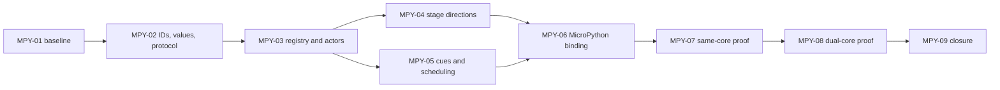

<!--
MPY-00-CONCEPTS.md - MicroPython stage-and-actors runtime concepts and phase map.
-->

# MPY-00 — MicroPython Stage-and-Actors Runtime Concepts

**Status:** Ratified 2026-08-09; amended 2026-08-15. Normative for the MPY
initiative. Phase documents remain separately gated and MUST be ratified before
their behavior implementation begins.

Requesting direction: MicroPython should be able to set up the UI, create
objects, register callbacks, set layout, and orchestrate application behavior,
while rlvgl remains responsible for lower-level object behavior, layout
execution, input, animation, rendering, and hardware interaction. The model is
derived from the earlier multiviewer vocabulary in which a scripting language
set the stage and actors performed the work.

## 0. Authority Policy

| Concern | Owner | MPY relationship |
|---|---|---|
| LVGL reference behavior and pinned source | `docs/concepts/LPAR-01-BASELINE.md` and the `lvgl/` submodule | MPY inherits the exact LPAR pin and MUST NOT silently define a second LVGL baseline. |
| rlvgl object, event, style, layout, property, and observer semantics | LPAR-02, LPAR-04, LPAR-07, LPAR-10, and LPAR-15 | MPY exposes these capabilities to a scripting runtime. It MUST amend the owning LPAR phase before changing their semantics. |
| Runtime object registry, descriptors, command/event protocol, and scripting-safe handles | MPY-02 through MPY-05 | MPY owns the language-neutral bridge that does not exist in the repository yet. |
| MicroPython module, Python object wrappers, callback registry, and exception mapping | MPY-06 | MPY owns the device-language adapter. MicroPython details MUST NOT leak into the core runtime contract. |
| Same-core simulator conformance | MPY-07 | MPY owns deterministic protocol and binding tests independent of board transport. |
| STM32H747I-DISCO CM7/CM4 transport and board integration | MPY-08 plus the applicable platform initiative | MPY owns the command/event use of the transport; platform code owns cache, interrupt, shared-memory, and boot mechanics. |
| Existing hardware-first integration sketch | `docs/future/MICROPYTHON-INTEGRATION.md` | Informative historical input. Where it conflicts with a ratified MPY document, MPY governs. |
| Qt/QML and creator authoring pipelines | `docs/qt-support/` and `docs/creator/` | Adjacent consumers. MPY MAY share descriptors with them but does not take ownership of their compile-time pipelines. |

If implementation uncovers a conflict with a frozen LPAR decision, the owning
LPAR document MUST be amended before MPY code changes that behavior. If an MPY
phase needs a focused tradeoff decision, create `MPY-NN-X.md`, resolve it, and
fold the result into this document before implementation proceeds.

## 1. Purpose

Define a language-neutral runtime contract that allows MicroPython to direct an
rlvgl UI without moving time-critical UI machinery into the virtual machine.
The contract covers:

- discovery of available actor types and their capabilities;
- generic creation and lifetime management of runtime objects;
- object-tree, property, style, state, and layout stage directions;
- typed event subscriptions and callback delivery;
- requested-state and computed-state introspection;
- deterministic behavior in both same-core and CM7/CM4 deployments; and
- bounded, `no_std + alloc`-compatible command and event processing.

The goal is semantic introspection parity with the pinned LVGL surface where
that behavior is meaningful for rlvgl. The goal is not a Rust transcription of
LVGL's private structures or pointer-oriented C ABI.

## 2. Problem Statement

The repository already contains most of the low-level actor machinery, but it
does not yet present a coherent scripting runtime:

1. `api/src/lib.rs` exposes a fixed `NodeKind` containing only `Rect` and
   `Text`, plus fixed `NodeSpec` structures. It cannot discover or construct the
   broader widget catalog.
2. `micropython/src/lib.rs` implements placeholder operations that return
   success without owning a live rlvgl stage.
3. `micropython/mp_module.c` exposes only initialization, stack clearing,
   presentation, statistics, and version queries. It does not expose generic
   object creation, mutation, inspection, or callback registration.
4. `core::object::ObjectNode` already owns richer tree, metadata, event,
   styling, scrolling, animation, and layout behavior, but nodes have no stable
   scripting identity or global lookup surface.
5. `core::property::Queryable` supports named reads and writes on a directly
   held widget, but it does not enumerate properties or describe their types,
   defaults, access modes, ranges, or enum domains.
6. Native widget callbacks and `Subject<T>` observers are heterogeneous Rust
   closures invoked synchronously. Those closures cannot safely become
   MicroPython callbacks, especially when the VM and UI runtime run on
   different cores.
7. rlvgl currently retains both compatibility `WidgetNode` and richer
   `ObjectNode` trees. A language binding cannot expose two competing identity
   and lifecycle models.
8. The pinned LVGL source provides class, tree, validity, event, and optional
   generic-property operations. rlvgl has adjacent behavior but no explicit
   introspection parity matrix tying it together.

Without a central runtime contract, adding Python wrappers widget by widget
would duplicate schema knowledge, expose inconsistent callback behavior, and
couple the MicroPython module to Rust storage details.

## 3. Canonical Glossary

| Term | Meaning | Owner and relationship |
|---|---|---|
| **Stage** | A runtime-owned UI session containing one or more roots, their object trees, ordering, requested layout/style/state, focus routing, subscriptions, and pending directions. It is broader than a display screen. | Owned by MPY; implemented over LPAR object/runtime semantics. Does not exist as a single repository type yet. |
| **Director** | The MicroPython application that owns high-level application state and decides which actors exist, how they are configured, and how cues affect later stage directions. | Owned by MPY-06; does not exist in the repository yet. |
| **Actor** | A live, runtime-owned object instantiated from a registered native actor type. It measures, participates in layout, handles native input semantics, animates, and draws through rlvgl. | Owned jointly by MPY runtime identity and the applicable rlvgl widget implementation. |
| **Cue** | A typed notification emitted by rlvgl for a subscribed actor and delivered to a director callback at a VM-safe point. A cue reports completed or observed runtime activity; it is not a synchronous call into Python. | Owned by MPY-05 and MPY-06; adapted from `core::object::ObjectEvent`. |
| **Stage Direction** | A typed command that requests object creation, deletion, tree mutation, property/state/style mutation, layout intent, subscription changes, or a commit boundary. | Owned by MPY-02 through MPY-05; does not exist as a complete command enum yet. |
| **Performance Turn** | One safe runtime turn in which a committed command batch is applied, native runtime work proceeds, and resulting cues become available in deterministic order. | Owned by MPY-05; does not exist as a named repository primitive yet. |
| **Object ID** | An opaque, generation-checked handle that identifies one live actor without exposing a Rust or C pointer. | Owned by MPY-02; does not exist in the repository yet. |
| **Callback ID** | An opaque token associating an rlvgl subscription with a callable retained by the MicroPython adapter. | Owned by MPY-05/06; does not exist in the repository yet. |
| **Request ID** | A correlation token connecting a command or committed batch to exactly one structured success or failure result, independently of asynchronous cues. | Owned by MPY-02; does not exist in the repository yet. |
| **Type Descriptor** | Discoverable schema for an actor type: stable identifier and name, ancestry or capabilities, constructor requirements, properties, actions, events, child policy, and target availability. | Owned by MPY-03; does not exist in the repository yet. |
| **Property Descriptor** | Schema for one named property, including value type, access mode, default or absence, constraints, invalidation effects, and applicable actor types. | Owned by MPY-03/04; extends but does not replace `core::property::Queryable`. |
| **Action Descriptor** | Schema for a typed actor operation that is not adequately represented as durable state, such as focus, scroll-to, start, stop, or collection mutation. | Owned by MPY-03/04; does not exist in the repository yet. |
| **Event Descriptor** | Schema for one event or cue, including payload fields, delivery policy, coalescing policy, and applicable actor types. | Owned by MPY-05; adapted from LPAR-04 event semantics. |
| **Requested Layout** | Director-authored layout intent such as flex/grid configuration, dimensions, constraints, placement, alignment, growth, or span. | Semantics owned by LPAR-10; scripting exposure owned by MPY-04. |
| **Computed Geometry** | Runtime-produced effective bounds and related layout results after actors measure and rlvgl performs layout. It is observable but not director-writable. | Semantics owned by LPAR-10; introspection exposure owned by MPY-04. |
| **Runtime Snapshot** | A deterministic, read-only projection of stage roots, actor identity/type, hierarchy, requested state, computed state, and active subscriptions. | Owned by MPY-04/07; does not exist in the repository yet. |
| **Transport Profile** | The carrier used for the same command/event protocol, initially in-process and later bounded CM7/CM4 queues. | Owned by MPY-02/07/08. |
| **Introspection Parity** | Named coverage of the pinned LVGL class, tree, creation, property, event, layout/style/state, and diagnostic surfaces using stable rlvgl semantics rather than raw LVGL pointers. | Baseline owned by LPAR-01; scripting coverage owned by MPY-01 and closed incrementally by later phases. |

The theatrical vocabulary is the application model. Internal and wire-level
types SHOULD retain neutral names such as `ObjectId`, `Command`, `UiEvent`, and
`TypeDescriptor` so non-Python adapters can consume the same contract.

## 4. Source-of-Truth Map

| Concept | Canonical artifact |
|---|---|
| MPY vocabulary, ownership boundary, invariants, phase order, and conflict policy | This document after ratification |
| Exact LVGL source pin and config assumptions | `docs/concepts/LPAR-01-BASELINE.md` |
| LVGL class creation and identity reference | `lvgl/src/core/lv_obj_class.h`, `lvgl/src/core/lv_obj.h` |
| LVGL tree and event reference | `lvgl/src/core/lv_obj_tree.h`, `lvgl/src/core/lv_obj_event.h` |
| LVGL generic property reference and feature assumptions | `lvgl/src/core/lv_obj_property.h`, `lvgl/lv_conf_template.h` |
| Current rlvgl object tree and event routing | `core/src/object.rs` |
| Current layout intent and execution | `core/src/layout.rs`, `core/src/widget.rs` |
| Current named property access | `core/src/property.rs` |
| Current direct observer behavior | `core/src/observer.rs` |
| Current shared binding API | `api/src/lib.rs` |
| Current MicroPython Rust and C shims | `micropython/src/lib.rs`, `micropython/mp_module.c` |
| Historical board-first work list | `docs/future/MICROPYTHON-INTEGRATION.md` |
| Per-phase acceptance evidence | MPY phase implementation changes and MPY-09 conformance artifacts |

## 5. Frozen Decisions — Stage, Director, and Actor Ownership

### 5.1 Ownership boundary

| Surface | Director owns | rlvgl owns |
|---|---|---|
| Application state | Domain state, navigation choices, data selection, and callback logic | No hidden copy of application-domain policy |
| Actor lifetime | Requested creation/deletion and retained Python wrappers | Actual allocation, handle validation, parentage rules, teardown, and stale-handle rejection |
| Tree | Requested roots, parent/child relationships, and sibling order | Structural integrity, lifecycle events, traversal, hit testing, and mutation safe points |
| Layout | Requested layout, dimensions, constraints, alignment, growth, and spans | Measurement, layout execution, computed geometry, invalidation, and draw placement |
| Properties and state | Requested property/state/style values | Type checks, applicability, side effects, defaults, invalidation, and computed state |
| Input and events | Subscription choices and later reactions | Device input, target resolution, native propagation, widget default behavior, and cue emission |
| Callbacks | Python callable registry and exception handling | Callback tokens, cue queue ordering, capacity behavior, and stale-subscription cleanup |
| Rendering | High-level selection of visible actors/assets | Drawing, clipping, composition, acceleration, presentation, and hardware interaction |
| Timing | Requested timers/animations and later policy reactions | Tick progression, animation interpolation, native deadlines, and frame pacing |

The director specifies intent. Actors perform native behavior. rlvgl remains the
authority on whether a requested direction is valid and when it is safe to
apply.

### 5.2 Actor scope

An MPY v1 actor MUST be backed by a registered native rlvgl type. MicroPython
MAY compose actors and MAY implement higher-level components as Python
factories, but v1 does not execute Python for drawing, measurement, hit testing,
or native event propagation. This preserves deterministic lower-level behavior
and supports a CM7 director controlling a CM4 runtime.

"Actor" does not imply an actor-model thread, task, mailbox, or coroutine. An
actor executes when the rlvgl runtime visits it for a command, event, layout,
tick, or draw operation.

### 5.3 One canonical stage model

The scripting API MUST expose one runtime object model. `ObjectNode` is the
semantic starting point because it carries LPAR object, event, style, scroll,
animation, and layout behavior. `WidgetNode` remains a compatibility surface
and MAY be adopted into a stage, but it MUST NOT become a second scripting
identity model.

Python object wrappers are conveniences over `ObjectId`; they do not own Rust
widgets or preserve their validity. Every operation revalidates the handle.
Dropping or garbage-collecting a wrapper MUST NOT implicitly delete its actor;
actor deletion is an explicit stage direction or a consequence of parent/stage
teardown. An active subscription keeps its Python callable reachable through
the adapter until unsubscribe, actor deletion, or stage teardown releases it at
a VM-safe point.

## 6. Frozen Decisions — Runtime Registry and Protocol

### 6.1 Stable identity without pointers

`ObjectId`, `CallbackId`, `RequestId`, type IDs, property IDs, action IDs, and
event IDs MUST have stable serialized representations. `ObjectId` MUST include
or reference a generation so deletion followed by slot reuse cannot make an
old Python object target a new actor. Raw Rust references, `Rc` addresses, and
LVGL pointers MUST NOT cross the runtime API or transport boundary.

The exact bit width and slot/generation partition remain an MPY-02 decision.

### 6.2 Discoverable actor catalog

Each scriptable actor type MUST register a `TypeDescriptor` near the native
implementation or through generated metadata derived from that implementation.
The descriptor is the canonical source for both generic creation and language
adapter discovery. A separately handwritten MicroPython widget table MUST NOT
become a second schema.

A descriptor MUST be able to answer, within target capabilities:

- which actor types are available;
- stable type ID and source-level name;
- ancestry or capability relationships;
- required and optional constructor inputs;
- readable and writable properties;
- typed actor-specific actions and their results;
- supported events and payload schemas;
- whether children are allowed and any child-type restrictions;
- layout container/item capabilities;
- target or feature-gate availability; and
- schema/API version requirements.

### 6.3 Typed value contract

The language-neutral value ABI starts with bounded variants for:

- signed and unsigned integers;
- booleans;
- precise or fixed-point values where the owning LPAR API requires them;
- colors;
- points, sizes, and rectangles;
- enumerated IDs;
- owned or interned UTF-8 text with explicit length;
- object, asset, image, font, and other registry handles; and
- explicit absence.

Every variable-sized value MUST declare ownership, capacity, and copy/borrow
rules. The protocol MUST NOT infer ownership from a pointer or NUL termination.

### 6.4 Commands, batches, and errors

The canonical protocol MUST support generic operations equivalent to:

```text
catalog_types, describe_type
create, delete, reparent, reorder
get, set, set_many, describe, children, snapshot
invoke
subscribe, unsubscribe
commit, poll_events
```

These names are illustrative, not a frozen language API. The frozen behavior is
that Pythonic methods and any future adapters lower to the same commands.

A batch MUST be fully validated and have required capacity reserved before its
first mutation. Once accepted, it MUST become visible as one stage transition
at a performance-turn boundary. Commands in a batch MUST be able to reference
actors created earlier in that batch through temporary batch-local references;
the completion result maps successful references to stable `ObjectId` values.

Every submitted command or batch carries a `RequestId` and produces exactly one
structured completion result. Command results and unsolicited cues are distinct
message classes even if a transport multiplexes them over one queue. Capacity
failures MUST report a structured error rather than expose a partially
constructed UI. Minimum error classes include stale handle, unknown
type/property/action/event, value type mismatch, read-only property, invalid
parent/child relationship, unsupported capability, capacity exhaustion, queue
overflow, dispatch busy, and protocol-version mismatch.

## 7. Frozen Decisions — Introspection and LVGL Parity

### 7.1 Introspection parity levels

MPY adopts the following scripting-facing parity levels. Adding or redefining a
level requires Standards Action in this document; marking individual rows
complete is Specification Required in MPY-01/09.

| Level | Surface | Required behavior |
|---|---|---|
| **MPY-I0 — Catalog** | Type/class discovery | Enumerate available actor types and inspect identity, capabilities, ancestry, constructor/action schema, and target availability. |
| **MPY-I1 — Object** | Creation, validity, tree, and lifecycle | Generic creation/deletion, stale-handle detection, parent/child traversal, sibling order, and lifecycle observation. |
| **MPY-I2 — State and actions** | Properties, actions, flags, states, style, and layout | Discover named typed properties/actions, invoke allowed operations, set requested layout, and inspect computed geometry separately. |
| **MPY-I3 — Events** | Event catalog and subscriptions | Discover event payloads, subscribe/unsubscribe with callback tokens, and receive deterministic typed cues. |
| **MPY-I4 — Diagnostics** | Snapshots and capability reporting | Produce deterministic stage snapshots, active-subscription views, queue/capacity statistics, and explicit unsupported markers. |

MPY parity claims MUST name a level, actor type or runtime surface, pinned LPAR
baseline, and evidence. A release MUST NOT claim generic "full LVGL
introspection parity."

### 7.2 Property discovery

`Queryable` is an implementation seed, not the complete scripting contract.
MPY MUST add property enumeration and descriptors without forcing every caller
to probe arbitrary strings. Source-level names SHOULD follow the LPAR/LVGL
naming policy. Numeric wire IDs MAY optimize transport but MUST resolve through
the same descriptor catalog.

Properties distinguish:

- readable, writable, read/write, and command-only access;
- requested values from computed values;
- absence from a default value;
- actor-local properties from object-wide flags/states/styles/layout;
- mutation effects such as layout, redraw, tree, or asset invalidation; and
- available from unsupported-on-this-target.

Actor actions cover operations that have meaningful arguments/results or
one-shot behavior but no stable property representation. They MUST be
discoverable and typed; a binding-specific method that bypasses the action
catalog would violate the single-schema rule. Implementations SHOULD prefer a
property when the value represents durable inspectable state and an action when
the operation represents a transition or collection command.

### 7.3 Runtime snapshots

A runtime snapshot MUST be deterministic for an unchanged stage and MUST avoid
raw addresses. At minimum it contains stage roots, each live `ObjectId`, actor
type, parent and ordered children, requested properties/layout, computed
geometry, object flags/states, and active subscription metadata. Large payloads
MAY be paged or capacity-bounded, but truncation MUST be explicit.

Snapshots are observation surfaces. Restoring a snapshot is not part of MPY v1;
declarative reconstruction lowers through ordinary commands and validation.

## 8. Frozen Decisions — Layout, Cues, and Runtime Turns

### 8.1 Layout is set by the director and performed by actors

MicroPython writes requested layout intent. Native actors supply intrinsic
measurement and size adoption behavior, while rlvgl resolves flex/grid/content
rules and stores computed geometry. Computed geometry MUST be read-only through
the scripting contract.

Layout-affecting directions SHOULD be batched with related creation and
property changes. The runtime MUST NOT present intermediate geometry from a
partially applied batch.

### 8.2 Cue delivery

The MicroPython adapter retains each Python callable and assigns it a
`CallbackId`. rlvgl retains only the token and subscription metadata. When an
event completes native routing, rlvgl emits a typed cue containing at least:

- monotonically ordered sequence information within the transport profile;
- target `ObjectId` and event ID;
- `CallbackId` or subscription ID;
- typed payload values;
- relevant event/source metadata; and
- an explicit coalesced/dropped marker when policy permits either behavior.

The VM drains cues and invokes Python only from a VM-safe context. rlvgl MUST
NOT directly call Python from an interrupt, rendering path, native event
traversal, CM4 task, or allocator-critical section.

### 8.3 Callback timing and propagation

Python callbacks observe cues after native event routing; they do not
retroactively consume the event that produced the cue. Where an application
needs native propagation or default-action policy, it configures declarative
subscription/actor policy before the event. A callback may enqueue new stage
directions, which become eligible at the next safe performance turn.

This rule preserves the existing `ObjectNode` constraint that structural
mutation cannot occur during active trickle/target/bubble traversal and keeps
same-core and dual-core behavior aligned.

### 8.4 Capacity and transport independence

The same logical command/event protocol MUST operate through an in-process
transport and a bounded CM7/CM4 transport. Target profiles MAY advertise
different capacities, actor availability, string limits, or snapshot page
sizes. Those differences MUST be discoverable and MUST NOT change command or
event meaning.

Queue overflow, cue coalescing, and backpressure policies are per event/command
class and MUST be documented. Silent loss is forbidden. Input motion or scroll
updates MAY be coalesced when the event descriptor declares it; lifecycle,
callback registration, deletion, and error events MUST NOT be silently
coalesced.

## 9. Frozen Decisions — Invariants and Phase Map

### 9.1 Initiative invariants

| Invariant | Normative statement | Verification surface |
|---|---|---|
| **INV-MPY-1** | The core runtime and protocol MUST remain language-neutral; no core crate may depend on MicroPython headers, VM objects, or Python callback storage. | MPY-02 dependency-direction build gate and binding-free core protocol tests. |
| **INV-MPY-2** | Every scripting-visible actor reference MUST be an opaque, generation-checked handle; no raw pointer may cross the API or transport boundary. | MPY-02 stale-handle, slot-reuse, serialization, and pointer-leak tests. |
| **INV-MPY-3** | Generic creation plus property, action, and event discovery MUST derive from one canonical actor descriptor catalog rather than adapter-specific schema tables. | MPY-03 descriptor completeness and MicroPython adapter projection tests. |
| **INV-MPY-4** | MicroPython MUST be able to set requested layout while computed geometry remains rlvgl-owned, read-only, and separately introspectable. | MPY-04 requested-versus-computed snapshot and layout transaction tests. |
| **INV-MPY-5** | rlvgl MUST deliver Python callbacks by tokenized queued cues at VM-safe points and MUST NOT invoke Python synchronously from native runtime or interrupt contexts. | MPY-05/06 callback-context, ordering, and forbidden-reentrancy tests. |
| **INV-MPY-6** | Callback-driven and multi-object mutations MUST enter through validated command batches and MUST NOT mutate the object tree during active native dispatch. | MPY-04/05 dispatch-busy, rollback, and atomic-visibility tests. |
| **INV-MPY-7** | In-process and dual-core transport profiles MUST preserve the same command meanings, event meanings, ordering rules, errors, and version negotiation. | MPY-07/08 shared trace conformance suite. |
| **INV-MPY-8** | Every bounded resource and variable-sized value MUST expose capacity, ownership, overflow, truncation, and backpressure behavior suitable for `no_std + alloc` targets. | MPY-02/08 no-std builds, capacity boundary tests, and queue stress tests. |
| **INV-MPY-9** | Every LVGL introspection parity claim MUST name its MPY-I level, covered surface, inherited LPAR pin, and deterministic evidence; generic full-parity claims are forbidden. | MPY-01 matrix schema and MPY-09 parity-claim audit. |
| **INV-MPY-10** | MPY v1 actor execution MUST remain native: Python may direct and compose actors but MUST NOT execute in draw, measurement, hit-test, or native propagation paths. | MPY-03/06 capability rejection tests and call-context instrumentation. |

### 9.2 Waves

| Wave | Phases | Goal | Parallelism rule |
|---|---|---|---|
| **Wave 0 — Baseline** | MPY-01 | Pin the inherited introspection target, inventory current coverage, and freeze claim vocabulary. | Serial; all parity claims depend on it. |
| **Wave 1 — Runtime identity and schema** | MPY-02 through MPY-03 | Establish handles, values, commands/events, registry, descriptors, and generic native actor construction. | MPY-02 precedes MPY-03. |
| **Wave 2 — Stage behavior** | MPY-04 through MPY-05 | Expose tree/property/style/state/layout directions, snapshots, subscriptions, queued cues, and safe turns. | MPY-04 and MPY-05 MAY proceed in parallel after MPY-03 freezes shared descriptor and handle types. |
| **Wave 3 — Language and host proof** | MPY-06 through MPY-07 | Deliver the MicroPython director API and prove it against an in-process simulator/runtime. | Host protocol fixtures MAY begin earlier; binding-level acceptance waits for MPY-06. |
| **Wave 4 — Dual-core deployment** | MPY-08 | Carry the same protocol over CM7/CM4 queues and prove on STM32H747I-DISCO. | Serial after the same-core semantics are stable. |
| **Wave 5 — Closure** | MPY-09 | Close matrix rows, examples, docs, performance/capacity evidence, SemVer, and release tracking. | Evidence runs continuously; initiative closure is last. |

### 9.3 Phase plan

| Phase | Scope | Depends on | Exit evidence |
|---|---|---|---|
| **MPY-01 — Introspection Baseline** | Inventory pinned LVGL class/tree/create/property/event/layout/state introspection; map current rlvgl surfaces; define MPY-I row schema and actor priority set. | LPAR-01, LPAR-02, LPAR-04, LPAR-07, LPAR-10, LPAR-15 | Committed matrix with current/partial/missing/unsupported status and no generic parity claims. |
| **MPY-02 — Identity, Values, and Protocol** | Define `ObjectId`, `RequestId`, other IDs, tagged values, command/result/event envelopes, batching, structured errors, version negotiation, and transport traits in the language-neutral API layer. | MPY-01 | `no_std` build; stale-handle model tests; deterministic encode/decode, correlation, and batch validation fixtures. |
| **MPY-03 — Runtime Registry and Actor Creation** | Add the stage registry/arena facade, actor descriptors, capability discovery, constructor schemas, generic creation/deletion, and `WidgetNode`/`ObjectNode` reconciliation. | MPY-02 | Catalog/descriptor completeness tests and generic creation of the first representative primitive, control, text, container, and composite actors. |
| **MPY-04 — Stage Directions and Introspection** | Add tree mutation, property/action/state/style APIs, requested layout, computed geometry, snapshots, atomic commits, and invalidation integration. | MPY-03, LPAR-07, LPAR-10, LPAR-15 | Transaction rollback/visibility tests; typed action fixtures; requested/computed layout fixtures; deterministic stage snapshots. |
| **MPY-05 — Cues and Safe Scheduling** | Add event descriptors, subscriptions, callback tokens, cue queues, safe performance turns, ordering, coalescing, overflow, and stale-subscription behavior. | MPY-03, LPAR-04, LPAR-05, LPAR-06 | Native-dispatch safety tests, cue ordering/overflow fixtures, and callback-mutation deferral tests. |
| **MPY-06 — MicroPython Director Binding** | Replace placeholder FFI behavior; expose Python stage/actor wrappers, descriptors, creation/mutation, transactions, callbacks, exceptions, and lifecycle cleanup. | MPY-04, MPY-05 | MicroPython tests create a UI, set layout, register callbacks, react to cues, inspect snapshots, and reject stale handles. |
| **MPY-07 — Same-Core Simulator Conformance** | Run the canonical command/event traces through the in-process runtime and MicroPython-facing API; provide deterministic frame/snapshot evidence and debugging tools. | MPY-06 | Shared scenarios pass through direct protocol and MicroPython paths with equivalent traces and snapshots. |
| **MPY-08 — CM7/CM4 Transport and Board Proof** | Implement bounded shared-memory queues, signaling, cache policy, boot sequencing, transport statistics, and a MicroPython-on-CM7/rlvgl-on-CM4 demonstration. | MPY-07 and applicable platform ownership | Board demo creates and orchestrates the stage; input cues return to Python; stress, wraparound, overflow, and recovery tests pass. |
| **MPY-09 — Parity Closure, Docs, and Release** | Close claimed MPY-I rows, publish examples and API docs, record footprint/capacity/performance, run no-std and board gates, update versions/changelog, and write the initiative retrospective. | MPY-01 through MPY-08 | Audited parity matrix, green release gates, explicit deferrals, SemVer review, and owner-declared initiative closure. |

### 9.4 Dependency map



## 10. Reconciliation Decisions

| Existing surface | MPY decision |
|---|---|
| `WidgetNode` | Compatibility/adoption input only. It does not receive a second scripting identity model. |
| `ObjectNode` | Semantic source for object metadata, tree behavior, events, styles, scrolling, animations, and layout. MPY-03 decides whether the handle facade wraps its current nested storage or refactors internal storage without breaking public compatibility. |
| `Widget` trait | Continues to own intrinsic bounds, drawing, native event handling, and optional adoption of computed bounds. Actor descriptors are additive and MUST avoid a broad breaking trait change unless separately approved through SemVer review. |
| `Queryable` and `PropertyValue` | Seeds for named typed access. MPY extends type coverage and adds enumeration/descriptors, applicability, access modes, and error detail. Existing callers remain source-compatible where practical. |
| `Subject<T>` | Remains a synchronous native value-binding primitive. It is not the cross-core callback or event protocol. An adapter MAY bridge subject changes into typed cues. |
| Native `FnMut` widget callbacks | Remain available to Rust applications. MicroPython subscriptions use `CallbackId` and queued cues rather than storing VM closures in widgets. |
| `NodeSpec` and z-index stack calls | Retained as a prototype or compatibility API as needed. Generic descriptor-driven actor creation and tree commands become the canonical MPY surface. |
| `present()` | May remain a display operation, but it MUST NOT be the only transaction mechanism. `commit` owns command-batch visibility; presentation policy remains runtime/platform-owned. |
| LVGL class/property structures | Behavioral reference only. MPY exposes stable descriptors and handles, never `lv_obj_class_t`, `lv_obj_t *`, or compile-time-private field layouts. |
| Qt/QML ingestion | Remains a compile-time authoring route. It MAY emit the same language-neutral stage directions or consume descriptors later, but MPY does not require that integration for v1. |
| CPython/PyO3 mirror | Optional host convenience after the canonical protocol and MicroPython behavior are proven. It is not the on-device binding and cannot define semantics independently. |

## 11. Non-Goals and Open Decisions

### 11.1 Non-goals

1. **Embedded Python rendering.** MPY v1 does not call Python to draw pixels,
   measure content, hit-test, or perform native event propagation.
2. **Raw LVGL ABI compatibility.** MPY does not expose LVGL or Rust pointers,
   private class structures, or a one-to-one transcription of C function names.
3. **Generic full-parity claim.** MPY does not imply every LVGL widget or
   optional feature is implemented or scriptable.
4. **Application framework policy.** Navigation architecture, domain models,
   persistence, networking, and application-specific state machines remain
   director/application concerns.
5. **Snapshot restoration.** Runtime snapshots are diagnostic in v1; they are
   not serialized application persistence.
6. **Unbounded dynamic behavior.** Targets are not required to provide
   unbounded strings, actor counts, callback counts, queues, or snapshot sizes.
7. **Immediate dual-core-first development.** The protocol is dual-core-ready,
   but semantic behavior is proven in-process before board transport is allowed
   to obscure runtime errors.

### 11.2 Resolved and phase-assigned decisions

- **PCDN-MPY-001 — Closed 2026-08-15 by MPY-02 ratification:** `StageId` is a
  non-reused `u32` within one Endpoint Epoch; `ObjectId` is a `u64` with upper
  `u32` generation and lower `u32` slot; and the remaining serialized ID widths
  are frozen by the MPY-02 §5.1 table across host, 32-bit MCU, and shared-memory
  transports.
- **PCDN-MPY-002 — Resolved by owner ratification:** The Python API uses
  `Stage` and `Actor` as its primary wrapper names over neutral protocol types.
- **PCDN-MPY-003 — Resolved by owner ratification:** Host binding conformance
  proves actual MicroPython behavior first. A CPython/PyO3 mirror remains an
  optional convenience and does not define semantics.
- **PCDN-MPY-004 — Assigned to MPY-05:** MPY-05 classifies which events allow
  declarative prevent-default, stop-propagation, or coalescing policy. Python
  callbacks remain post-dispatch regardless of the selected policy.
- **PCDN-MPY-005 — Closed 2026-08-09 by MPY-01 ratification:** The
  representative actor set is `rlvgl_widgets::container::Container`,
  `rlvgl_widgets::label::Label`, `rlvgl_widgets::button::Button`,
  `rlvgl_widgets::slider::Slider`, and `rlvgl_widgets::list::List`, frozen as
  `INV-MPY-01-4`. See MPY-01 §7.
- **PCDN-MPY-006 — Closed 2026-08-15 by MPY-03 ratification:** Actor-local
  declarative Rust schemas are canonical and derive compact runtime tables,
  constructor/operation functions, binding metadata, and optional generated
  projections. Actor records use the additive parallel `ActorOps` adapter
  selected in MPY-03 §6.3, preserving `INV-MPY-3`, `no_std + alloc`, and the
  existing public `Widget` trait.

## 12. Acceptance Checklist

Owner ratification confirms:

- [x] `INV-MPY-1` ownership between the language-neutral runtime and the MicroPython adapter is accepted.
- [x] `INV-MPY-2` opaque generation-checked identity is accepted, with bit layout explicitly deferred to MPY-02.
- [x] `INV-MPY-3` establishes one descriptor catalog for creation and introspection.
- [x] `INV-MPY-4` accepts requested layout as director-owned and computed geometry as rlvgl-owned.
- [x] `INV-MPY-5` accepts queued VM-safe callbacks instead of synchronous Python event handlers.
- [x] `INV-MPY-6` accepts validated batches and post-dispatch callback mutations.
- [x] `INV-MPY-7` accepts one semantic protocol for in-process and dual-core profiles.
- [x] `INV-MPY-8` accepts explicit bounded-resource and ownership behavior.
- [x] `INV-MPY-9` accepts level-scoped introspection parity claims and the inherited LPAR pin.
- [x] `INV-MPY-10` accepts native-only actor execution for MPY v1.
- [x] The MPY-01 through MPY-09 phase map is accepted without weakening `INV-MPY-1` or `INV-MPY-7`.
- [x] PCDN-MPY-001 through PCDN-MPY-006 are resolved or assigned to the named phase without weakening `INV-MPY-2`, `INV-MPY-3`, or `INV-MPY-5`.

## 13. Files Cited

- `docs/concepts/MPY-01-INTROSPECTION-BASELINE.md`
- `docs/concepts/MPY-02-IDENTITY-VALUES-PROTOCOL.md`
- `docs/concepts/LPAR-00-CONCEPTS.md`
- `docs/concepts/LPAR-01-BASELINE.md`
- `docs/concepts/LPAR-02-OBJECT-SUBSTRATE.md`
- `docs/concepts/LPAR-04-EVENT-FOCUS-INPUT.md`
- `docs/concepts/LPAR-07-STYLE-THEME.md`
- `docs/concepts/LPAR-10-LAYOUT.md`
- `docs/concepts/LPAR-15-CANVAS-MEDIA-PROPERTY-OBSERVER.md`
- `docs/future/MICROPYTHON-INTEGRATION.md`
- `api/src/lib.rs`
- `micropython/src/lib.rs`
- `micropython/mp_module.c`
- `core/src/lib.rs`
- `core/src/object.rs`
- `core/src/layout.rs`
- `core/src/property.rs`
- `core/src/observer.rs`
- `core/src/widget.rs`
- `lvgl/src/core/lv_obj_class.h`
- `lvgl/src/core/lv_obj.h`
- `lvgl/src/core/lv_obj_tree.h`
- `lvgl/src/core/lv_obj_event.h`
- `lvgl/src/core/lv_obj_property.h`
- `lvgl/lv_conf_template.h`

## 14. Unblocks

MPY-01, MPY-02, and MPY-03 are ratified. MPY-02's canonical codec and vectors
satisfy the protocol prerequisite, and MPY-03's five-actor adapter experiment
satisfies its ratification evidence gate. The production Stage Registry,
actor-local descriptor catalog, generic five-actor Create fixture, bounded
preflight, stable lookup, and subtree deletion now satisfy MPY-03's
implementation exit gate. MPY-04 and MPY-05 drafts are dependency-unblocked for
PCDN review and separate ratification. MPY-04 through MPY-09 remain separately
gated Draft phases and MUST close their own PCDNs and §12 acceptance gates
before behavior implementation.

## 15. Change Log

### 0.1.0 — 2026-08-09 — Drafted

**Author:** OpenAI Codex with owner direction

**Change kind:** semantic

**Touches:** INV-MPY-1, INV-MPY-2, INV-MPY-3, INV-MPY-4, INV-MPY-5, INV-MPY-6, INV-MPY-7, INV-MPY-8, INV-MPY-9, INV-MPY-10, §0–§14

**Commits:** pending

**Summary:** Defines the MicroPython stage-and-actors ownership model,
language-neutral runtime registry, semantic introspection parity levels,
requested-versus-computed layout boundary, queued callback model, and the
MPY-01 through MPY-09 phase map.

#### Rationale

The previous hardware-first sketch proved the binding and transport direction
but stopped at a fixed rectangle/text stack. MicroPython cannot orchestrate the
full UI from that surface. A discoverable, transport-independent runtime object
contract must precede additional Python wrappers so object identity, creation,
properties, layout, callbacks, and dual-core behavior do not diverge by widget
or adapter.

### 0.2.0 — 2026-08-09 — Ratified

**Author:** Ira Abbott

**Change kind:** semantic

**Touches:** INV-MPY-1, INV-MPY-2, INV-MPY-3, INV-MPY-4, INV-MPY-5, INV-MPY-6, INV-MPY-7, INV-MPY-8, INV-MPY-9, INV-MPY-10, PCDN-MPY-001, PCDN-MPY-002, PCDN-MPY-003, PCDN-MPY-004, PCDN-MPY-005, PCDN-MPY-006, §0–§14

**Commits:** pending

**Summary:** Owner ratified the stage-and-actors ownership model, all ten
initiative invariants, the introspection parity levels, and the MPY-01 through
MPY-09 phase map. PCDN-MPY-002 and PCDN-MPY-003 are resolved as recommended;
the other four decisions are assigned to their named phases.

#### Rationale

The concepts now establish a coherent separation between MicroPython direction
and native rlvgl performance while preserving a single protocol across
same-core and dual-core deployments. Phase-level detail can proceed without
reopening the initiative's ownership, callback, layout, or parity boundaries.

### 0.2.1 — 2026-08-09 — Amended: PCDN-MPY-005 closed

**Author:** Ira Abbott

**Change kind:** semantic

**Touches:** PCDN-MPY-005, §11.2, §13, §14

**Commits:** pending

**Summary:** Records the owner-ratified closure of `PCDN-MPY-005` by MPY-01,
freezes the representative actor set as `INV-MPY-01-4` with fully qualified
`rlvgl_widgets` module paths, and preserves MPY-02 through MPY-09 as
separately gated Draft phases.

#### Rationale

This amendment changes `PCDN-MPY-005` from phase-assigned to resolved in the
ratified parent, so it is semantic rather than editorial. MPY-00 §11.2
delegates four decisions to named phases. A phase document answering one of
them does not close it here; without a back-amendment the parent reads as
having four open decisions indefinitely. MPY-01 §14 now makes this amendment
the closure act, and names the same obligation for `PCDN-MPY-001` (MPY-02),
`PCDN-MPY-006` (MPY-03), and `PCDN-MPY-004` (MPY-05).

Considered and rejected: leaving `PCDN-MPY-005` marked assigned after MPY-01
resolved it, or treating the MPY-01 document alone as the parent closure. Both
would leave the parent source of truth stale and make the decision's binding
status ambiguous.

What deliberately did not change: `PCDN-MPY-001`, `PCDN-MPY-004`, and
`PCDN-MPY-006` remain assigned to MPY-02, MPY-05, and MPY-03 respectively;
MPY-02 through MPY-09 remain Draft; and this documentation amendment does not
authorize behavior implementation in any later phase.

### 0.2.2 — 2026-08-15 — Amended: PCDN-MPY-001 closed

**Author:** Ira Abbott

**Change kind:** semantic

**Touches:** PCDN-MPY-001, §0, §11.2, §13, §14

**Commits:** pending

**Summary:** Records the owner-ratified closure of `PCDN-MPY-001` by MPY-02,
adopts the serialized ID widths and Endpoint Epoch boundary from MPY-02 §5.1,
and advances the initiative gate to protocol implementation and golden-vector
evidence while preserving MPY-03 through MPY-09 as separate Draft phases.

#### Rationale

MPY-00 delegated serialized ID widths and the `ObjectId` slot/generation split
to MPY-02. MPY-02 now freezes those values, resolves all of its phase PCDNs,
and is ratified, so leaving the parent decision assigned would make the parent
source of truth stale.

Considered and rejected: leaving the parent PCDN assigned until MPY-03, which
would give a consumer phase apparent authority to reopen MPY-02's wire IDs; and
closing it without citing the phase table, which would make the selected widths
hard to audit.

What deliberately did not change: `PCDN-MPY-004` and `PCDN-MPY-006` remain
assigned to MPY-05 and MPY-03; golden protocol vectors remain required before
MPY-03 implementation; MPY-03 through MPY-09 remain Draft; and this amendment
does not resolve any later phase's PCDNs.

### 0.2.3 — 2026-08-15 — Amended: PCDN-MPY-006 closed

**Author:** Ira Abbott

**Change kind:** semantic

**Touches:** PCDN-MPY-006, INV-MPY-3, §0, §11.2, §13, §14

**Commits:** pending

**Summary:** Records the owner-ratified closure of `PCDN-MPY-006` by MPY-03.
Actor-local declarative Rust schemas are the canonical source for runtime and
binding projections, and the parallel `ActorOps` adapter supplies additive
native erasure without changing `Widget`.

#### Rationale

MPY-00 delegated descriptor source ownership to MPY-03. MPY-03 now fixes the
actor-local schema and derived-projection rule, selects the adapter boundary,
and compile-proves that boundary for the representative actor set. Leaving the
parent decision assigned would make the initiative source of truth stale.

Considered and rejected: independently authored binding tables, which violate
`INV-MPY-3`; treating the compile experiment as production descriptor
implementation, which would overstate current coverage; and closing the PCDN
only in MPY-03 without the parent back-amendment required by MPY-01 §14.

What deliberately did not change: `PCDN-MPY-004` remains assigned to MPY-05;
the Stage Registry, descriptor catalog, generic Create behavior, and coverage
claims remain implementation work; and MPY-04 through MPY-09 remain separately
gated Draft phases.

### 0.2.4 — 2026-08-15 — Amended: MPY-03 implementation exit gate satisfied

**Author:** OpenAI Codex with owner direction

**Change kind:** implementation status

**Touches:** INV-MPY-2, INV-MPY-3, INV-MPY-8, §0, §13, §14, §15

**Commits:** pending

**Summary:** Records production evidence for the MPY-03 Stage Registry,
actor-local descriptor catalog, generic actor creation, deletion, identity
generation, and conservative resource accounting. The MPY-03 implementation
exit gate is satisfied, so the MPY-04 and MPY-05 Draft phases are now
dependency-unblocked while retaining their own PCDNs and evidence gates.

#### Rationale

The production implementation replaces the earlier compile-only experiment
with an always-on `no_std + alloc` registry in `rlvgl-core` and canonical
actor-local descriptors in `rlvgl-widgets`. Focused tests cover all five proof
actors, pre-publication validation failures, capacity failures, subtree
deletion, stale-object rejection, generation advancement, unrelated-object
preservation, and stage teardown.

What deliberately did not change: MPY-04 and MPY-05 remain Draft; direction,
introspection, cue, and scheduling semantics are not authorized by MPY-03;
and incomplete coverage rows remain marked `partial` until their owning phases
provide implementation evidence.
