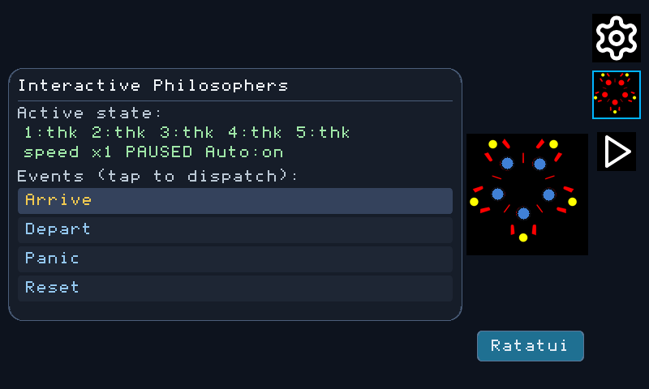

<!--
RELEASE-v0.2.5.md - Product-level release notes for rlvgl v0.2.5.
-->

  

# rlvgl v0.2.5 Release Notes

`v0.2.5` is the **Qt → reactive rlvgl** release. `rlvgl-creator` can now
turn a Qt/QML screen into a Rust widget tree *and* emit the binding
tables that let a consuming app wire it to a state machine, so machine
state drives the pixels and screen taps drive the machine with only a
small app-owned vocabulary map. It ships the worked example that proves
the whole path end to end: the **SCTD demo** (Setup + Dining Philosophers
+ a Škoda *Bolero* media player) mounted on simulator, STM32H747I-DISCO,
UEFI, and ESP32-P4 hosts.

It also introduces the first `ratatui-rlvgl` crate and a Dining Philosophers
hero window that demonstrates two-way Ratatui ↔ rlvgl composition with Rust
all the way down.

## Short Release Summary

The `qt emit` pipeline grows a full **reactive binding** surface. A new
`--scxml-context` flag links the emitted widget tree to a generated
state-machine crate (authored at [softoboros.com/istate](https://softoboros.com/istate));
the emitter then produces typed bindings that flip artwork, show/hide
widgets, cycle through state-dependent images, route button taps into
machine events, and bind labels to external live data — each refreshed
through a single caller-driven pump. A new tutorial series,
[`docs/sctd-tutorial/`](../sctd-tutorial/README.md), walks the whole
state-chart-to-reactive-UI workflow using only public tools.

Emitter v23 also brings generated-Rust conformance: precedence-aware bounds
expressions omit neutral operations, Rust symbols are deterministic snake
case while QML tags remain unchanged, helper bindings use a private sink,
leaf builders return directly, and `build_screen` exposes a documented
`BuiltScreen` tuple alias.

## Highlights

### Ratatui ↔ rlvgl: Rust all the way down

`ratatui-rlvgl` `0.1.0` provides a `no_std + alloc` Ratatui backend whose cell
surface is rendered by `RatatuiView` as an ordinary rlvgl widget. It depends on
`ratatui-core` and `rlvgl-core`, with no C LVGL, FFI, embedded-graphics, or C
toolchain in the path.

The SCTD Dining Philosophers screen keeps its native graphical table and adds
a graphical `Ratatui` launcher. The resulting near-full-screen hybrid window
uses native rounded chrome, title bar, close control, and action buttons around
a Ratatui-rendered spatial table. Both presentations share the same generated
state machine, and closing/reopening preserves the current philosopher state.
The host and STM32H747I-DISCO use the same integration surface.

### Reactive Qt → rlvgl emitter

`rlvgl-creator qt emit --target rlvgl --scxml-context <ctx>=<crate>` now
emits, alongside `build_screen()`, a `Machine` handle and a list of
`Binding`s. Five binding kinds were added across QT-05g…05k (emitter
output version `14` → `23`, istate linkage v2 — the dynamic-string
`step` / `is_active` / `get_var` / `Value` surface):

- **State-predicate bindings** (QT-05g) — `source: ctx.<state> ? A : B`
  on an `Image` swaps artwork from `machine.is_active("<state>")`. The
  play/pause button is the canonical case.
- **Visibility bindings** (QT-05h) — `visible: ctx.<state>` shows or
  hides a widget via `is_active` (the mute icon).
- **Chained-predicate bindings** (QT-05i) — a chained ternary
  `ctx.s1 ? A : ctx.s2 ? B : C` lowers to a first-active-wins ladder (the
  repeat-mode icon).
- **Button-event bindings** (QT-05j) — `onReleased` handlers lower to a
  `BUTTON_TAP_EVENTS` table (widget tag → raw QML event); the consumer
  owns the vocabulary map that turns it into a machine input, then calls
  `machine.step(...)`.
- **External-text bindings** (QT-05k) — `text: <obj>.<prop>` reading an
  object outside the machine lowers to an `EXTERNAL_TEXT_BINDINGS` table
  plus `apply_external_text(bindings, resolve)`; the consumer owns the
  key→value resolver (e.g. the live track caption).

A single caller-driven `refresh_bindings(state, machine, bindings)`
refreshes all machine-driven bindings; external text runs on its own
cadence. The emitter stays app-agnostic — it emits tables and typed
handles; the consuming app supplies the meaning (event vocabulary, text
resolver).

Supporting emitter work: the **sibling-anchor solver** (QT-03c) resolves
`<id>.<edge>` anchors and component instantiation, raising media-player
ingest fidelity to the full transport-control bar.

### Runtime artwork in `rlvgl-widgets`

- `Image::set_pixels(width, height, &[Color])` — swap an image's pixels
  at runtime (drives the predicate/chain bindings).
- `Image::set_hidden(bool)` — a hidden image's `draw` is a no-op (drives
  the visibility bindings).

### Asset transparency for RGB565

`rlvgl-creator compress … --transparent-key` maps source pixels with
alpha < 128 to a magenta (`#FF00FF`) sentinel. RLE blobs are RGB565 (no
alpha); the `qt_image` helper keys magenta back to transparent at render
time, recovering 1-bit transparency for icons with alpha edges — no
shared-codec change.

### The SCTD demo (new example app)

[`examples/apps/sctd-demo/`](../../examples/apps/sctd-demo/) — the SCXML
Tutorial Demo, a shared `no_std` controller with a right-edge screen
selector over three top-to-bottom slots: **Setup**, **Dining
Philosophers**, and **Media Player**. The demo boots into the Dining
Philosophers run view; Setup configures the two runnable screens.

- **Setup** — per-screen configuration, including DP Auto mode and Media
  Player source / Auto-Ready options.
- **Dining Philosophers** — the classic concurrency puzzle, using the
  interactive true-parallel machine with on-screen arrive / depart / panic /
  reset controls, DP Auto mode, and a live Philosophers Table illustration
  that overlays seat state on the tutorial artwork.
- **Media Player** — the Škoda *Bolero* infotainment screen, with the
  reactive transport bar (play/pause, repeat, shuffle, mute, source,
  live caption) described above.

The demo is mounted on four hosts: the desktop simulator
(`rlvgl-sctd-sim` in `examples/disco-sim`), bare-metal STM32H747I-DISCO,
the UEFI backend, and the **FireBeetle-2 ESP32-P4** ESP-IDF C+Rust hybrid
(`examples/beetle-esp32p4-idf`, default payload `app_sctd`).

### State machines from state charts

The two machine crates under `examples/apps/sctd-demo/machines/` are
generated from SCXML via iState codegen — the media player normalized
from `bolero.scxml`, and the interactive Dining Philosophers machine that
SCTD-03 uses for both manual controls and Auto mode. Charts that use the
SCXML `In()` cross-region predicate are normalized to explicit datamodel
variables (`s_mute`, `s_repeat`, `s_source`) so they fit the constrained
expression evaluator.

### ESP32-P4 bring-up (BEETLE-IDF)

- `dfr0550` raw-PAC `clk_init` + `regi2c` bring-up (work in progress).
- Software star-crawl effect; the ESP-IDF-hybrid documentation family.

## Documentation

- **[`docs/sctd-tutorial/`](../sctd-tutorial/README.md)** — a new
  five-chapter tutorial: state chart → iState machine, media-asset
  conversion, QML → widget tree, reactive wiring, and build/run on
  desktop and ESP32-P4. Written for readers outside the monorepo.
- `docs/qt-support/` gains the QT-05g…05k binding chapters and the
  media-player ingest retrospective.
- **[`docs/concepts/SCTD-04-RATATUI-RLVGL-INTEGRATION.md`](../concepts/SCTD-04-RATATUI-RLVGL-INTEGRATION.md)**
  records the two-way integration contract, host/hardware execution, and
  deterministic GIF capture.

## Publication order

The release publisher includes the first `ratatui-rlvgl` `0.1.0` publish
immediately after `rlvgl-core`, before downstream rlvgl crates. Gate P packages
the crate from the pinned `vendor/ratatui` submodule by manifest path. A PR to
the Ratatui project follows separately after this release.

`rlvgl-core` is published as `0.2.5`; the release also adopts fixed-size slice
chunks in the GIF, JPEG, and PNG decoders and the host simulator's mutable
pixel loops. This satisfies the refreshed nightly Clippy gate while preserving
the existing remainder handling.

## Attribution

The SCTD demo's state charts and media-player artwork are derived from
the **SCXML Tutorial** by **Alexander Zhornyak**
(<https://github.com/Alexzhornyak/SCXML-Tutorial>), licensed **BSD
3-Clause, © 2017 Alexander Zhornyak**. The vendored tutorial assets keep
their upstream BSD 3-Clause license; rlvgl itself remains MIT
(© 2025 SoftOboros).

## Known issues / work in progress

- The `dfr0550` raw-PAC bring-up on `examples/beetle-esp32p4` is WIP; the
  supported ESP32-P4 path for the SCTD demo is the ESP-IDF hybrid
  (`examples/beetle-esp32p4-idf`).
- The fixture machine crates under `examples/apps/sctd-demo/machines/`
  are `publish = false` (CRATES-CI-01) and excluded from the workspace;
  run their vector tests via `--manifest-path`.
